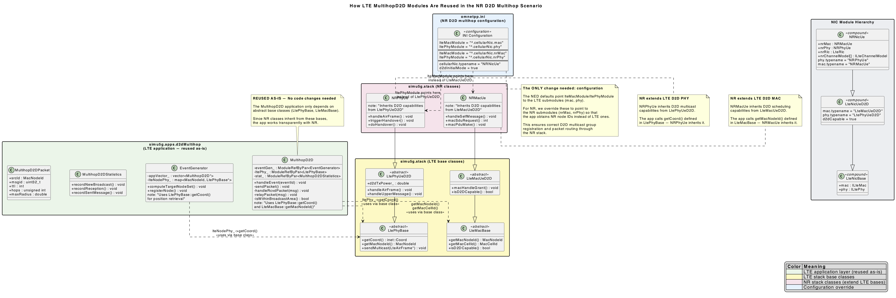

# NRMultihopD2D

The `omnetpp.ini` for the NR D2D multihop scenario is based on the LTE version with three critical NR-specific adaptations:
 
1. __NR cell association__: UEs set `macCellId=0, masterId=0` (no LTE master) and `nrMacCellId/N, nrMasterId/N` (NR master = their gNodeB). This makes `IP2Nic::markPacket()` route all traffic through the NR stack.
 
2. __NR NIC types__: `cellularNic.typename = "NRNicUe"` / `"NRNicEnb"` instead of LTE NICs, plus `d2dInitialMode = true` to start D2D flows in direct mode.
 
3. __App module path override__: `lteMacModule = "^.cellularNic.nrMac"` and `ltePhyModule = "^.cellularNic.nrPhy"` — this redirects the MultihopD2D app to use NR submodules so it obtains NR node IDs for D2D multicast registration and routing. This is the only change needed to make the LTE application work with NR.
 
The four config variants (MultihopD2D, MultihopD2D-Trickle, MultihopD2D-rangeCheck, MultihopD2D-rangeCheckTrickle) mirror the LTE scenario, with NR-specific parameters like `nrChannelModel`, `nrPhy.d2dTxPower`, and `nrPhy.enableMulticastD2DRangeCheck` properly set.

For class diagram, please check the following file:

  
📸 Click here to expand and preview the document

  
  

